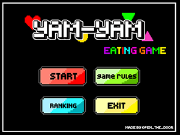
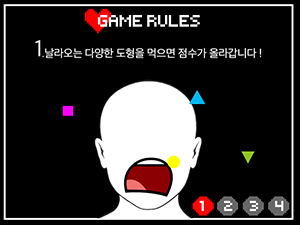
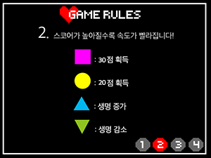
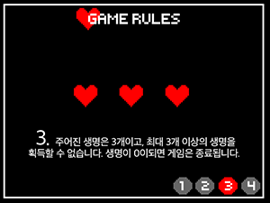
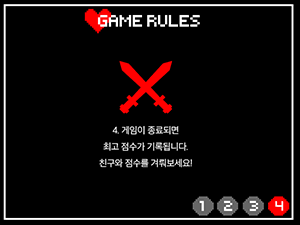
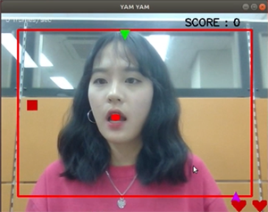
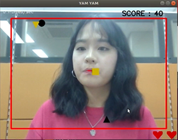
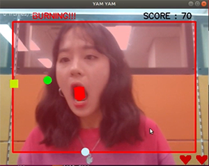
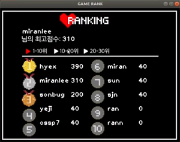
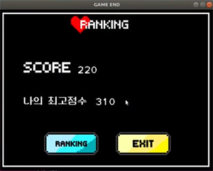

# 2019-1-OSSP2-Openthedoor-7

## "YAM-YAM" Game program using Face Tracker

> 얼굴을 인식해 도형을 먹으며 점수를 올리고, 최고 점수가 기록되어 친구와 경쟁할 수 있는 게임 프로그램입니다. 
* OpenCV 기반 Face Tracker와 OpenGL 이용하여 게임 제작
* Node.js, AWS EC2, RDS를 이용한 서버 및 DB 구축

## 개발 환경
<pre>
- Develop Tool: C++, Open CV2, Open GL, Node.js, MySQL, aws ec2, aws RDS
- Develop Environment: Ubuntu Linux Extension Pack (16.04 버전 사용, 18.04 호환 가능)
</pre>

## 실행 방법

### 1. Web Camera 실행하기

우분투에서 웹카메라를 활성화하기 위해선 두가지의 옵션이 있습니다.

 (1) Virtual Box를 사용하는 경우

* [Virtual Box](https://www.virtualbox.org/wiki/Downloads)로 이동하여 설치된 Virtual Box 버전과 맞는 Extension Pack을 설치해주세요.
* 웹캠을 활성화해주세요.

 (2) 가상머신 없이 우분투를 사용하는 경우
* 바로 아래 단계로 이동해주세요.

** 웹카메라가 정상적으로 실행되는지 확인하시려면 cheese를 설치하셔서 확인하세요.

### 2. OpenCV 설치하기
<pre>
$ sudo apt-get update
$ sudo apt-get install -y build-essential
$ sudo apt-get install libcv-dev libopencv-dev
</pre>
OpenCV 버전2 설치를 권장합니다. 우분투 버전에 맞게 설치를 진행해주세요.

위의 명령어로 설치가 정상적으로 진행되지 않는다면 [OpenCV GitHub](https://github.com/opencv/opencv)에 가서 매뉴얼대로 설치를 진행해주세요.

### 3. OpenGL 설치하기
<pre>
$ sudo apt-get update
$ sudo apt-get install -y build-essential
$ sudo apt-get install freeglut3-dev libglu1-mesa-dev mesa-common-dev
$ sudo apt-get install libsdl2-dev  # 사운드
</pre>

### 4. 실행하기
<pre>
$ git clone https://github.com/CSID-DGU/2019-1-OSSP2-Openthedoor-7.git  
$ cd FaceTracker
$ make   # 옵션을 추가해서 빌드시 에러 발생 
$ cd bin
$ ./face_tracker
</pre>

 게임 사용 방법은 **시연 영상**을 참고해주세요 !

## 실행 화면
### 1. INTRO

### 2. GAME RULE

### 3. GAME

### 4. RANK

## 팀원
<pre>
김예지(2017112065) - Open GL 도형 구현
김혜지(2017112082) - 서버, 소켓 구현
신소희(2017112106) - 팀장, 서버, 소켓 구현
이미란(2017112076) - Face tracker 및 Open CV 영상 처리, UI제작
</pre>

## 오픈소스 출처

* FaceTracker
<https://github.com/kylemcdonald/FaceTracker>
* OpenCV
<https://github.com/opencv/opencv> 
* OpenGL
<https://www.opengl.org/>
* Node.js
<https://nodejs.org/ko/>

## 디렉토리 구조 
<pre>
Server
├── app.js
├── bin
├── config
├── module
│   └── pool.js
├── node_modules
├── npm-debug.log
├── package.json
├── package-lock.json
├── public
├── routes
│   ├── first.js
│   ├── index.js
│   ├── ranking.js
│   ├── rank.js
│   ├── score.js
│   ├── signin.js
│   ├── signup.js
│   └── users.js
└── views
    
</pre>
<pre>
FaceTracker
  |src
    |exe
       | face_tracker.cc # Main File
</pre>

## 문의
작동 오류 문의 - 김예지()
                김혜지()
                신소희(skysohe@naver.com) 
                이미란(rannan09@naver.com)
